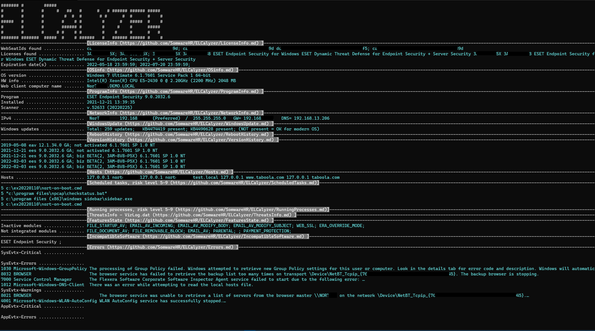

# ELCalyzer

ESETLogCollector "analyzer"

## Description

Displays several most frequently searched info from logs collected by ESET Log Collector (ELC).

Main idea behind this is:

+ I need to frequently check same specific data from logs
+ I never write it down
+ so - I always have to look back into log files
+ there is like 100 log files
+ I never remember which file carries which data I need at the moment
+ "grep" is main helper, but sometimes I need data in more-or-less formatted form.

Thus - ELCalyzer.

Read only.

Tested with Powershell 5 and pwsh 7 on Windows.

## Command-line parameters

Default: `none`

## Prerequisites

ELC.EXE in path or folder. Can be downloaded with parameter "-DownloadELC"

## Usage

1. Collect logs with ELC
2. Unzip them in folder C:\TMP\LOGS\
3. Position in folder C:\TMP\LOGS\
4. Execute    `pwsh -file ELCalyzer.ps1 -all`    (see "Examples" for more.. examples)

Help is included in script:   `Get-Help ELCalyzer.ps1 -full`

### NAME

    E:\Dev22\ELCalyzer\ELCalyzer.ps1

### SYNOPSIS

    ELCalyzer v.22.0303.10 Beta

    ESETLogCollector "analyzer"

### SYNTAX

    E:\Dev22\ELCalyzer\ELCalyzer.ps1 [-Help] [-Conversion] [-DownloadELC] [-LicInfo] [-OSInfo] [-ProgramInfo] [-RebootHistory] [-VersionHistory] [-ThreatsInfo] [-Everything] [-DisplayHeaders] [-ShowModules] [<CommonParameters>]

### DESCRIPTION

    ELCalyzer displays most frequently used data from uncompressed logs collected by ESET Log Collector (ELC).
    Script must be run from ELC's root directory (where metadata.txt and info.xml files are).
    Script should simply skip any nonexistent file.
    (C)SomwareHR ... https://github.com/SomwareHR/elcalyzer ... License: MIT ... SWID#20220303091402

### PARAMETERS

    -Help
    -Conversion         Convert .DAT to .TXT and .EVTX to .CSV
    -DownloadELC         Download ESETLogCollector and save it to ELC.EXE in current folder.        https://download.eset.com/com/eset/tools/diagnosis/log_collector/latest/esetlogcollector.exe
    -LicInfo         Displays license info
    -OSInfo         Well.. displays OS info
    -ProgramInfo         ESET's program(s) info
    -RebootHistory         Show history of computer reboots (System:EventID:6005)
    -VersionHistory         History of program's upgrades
    -ThreatsInfo         Show last 5 threats from "virlog.dat"        Prerequisite: -convert
    -DisplayHeaders         Display table headers where possible (Format-Table)
    -ShowModules         Lists all ESET security program modules
    -Everything

### INPUTS
    n/a

### OUTPUTS
    Text file

### Examples

    PS>ELCalyzer.ps1 --LicInfo ... displays license info (PLID, SeatID)
    PS>ELCalyzer.ps1 --Convert -ThreatsInfo ... convert DAT to XML, EVTX to CSV and then display last 5 threats
    pwsh -file elcalyzer.ps1 -all >redirect.txt ... redirect output to a file
    pwsh -file elcalyzer.ps1 -all | clip ... (Windows) redirect output to a clipboard

## Output

## ToDo

### Priority: High

+ "-WindowsUpdate -wu" ... Windows update status
+ "-NetworkInfo   -ni" ... Network info

### Priority: Middle

+ "-EnumerateFiles -ef" ... Enumerate ELC's log files and check if everything was collected

### Priority: Low

+ ...

## Misc

Ideas welcomed. Be reasonable, I'm just a script-kiddie.

###### Info

+ ELCalyzer v22.0303.10 Beta
+ https://github.com/SomwareHR/ELCalyzer
+ (C)2022 SomwareHR
+ License: MIT
+ SWID#20220303091402
